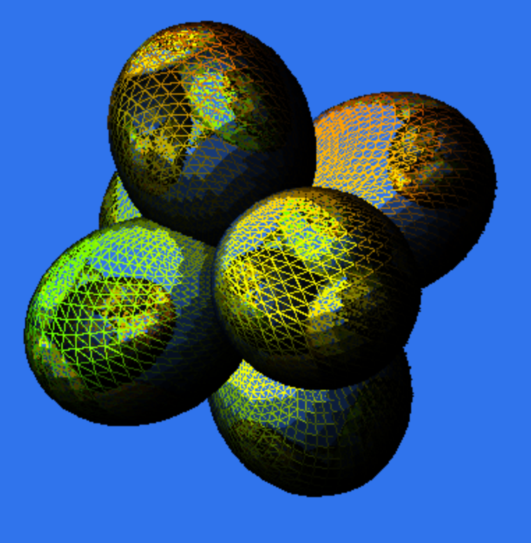

i-can-haz-js3 is a small scale software-only 3d engine
based on a six dimensional Bresenham implementation from
[proyectosroboticos](https://sites.google.com/site/proyectosroboticos/bresenham/bresenham-6d).
The dimensions are the typical xyz + texture space.

The code style is quirky and based on an older style I've long abandoned.
Nonetheless, perhaps it is somewhat interesting.

Warning: some of this is completely nuts.

